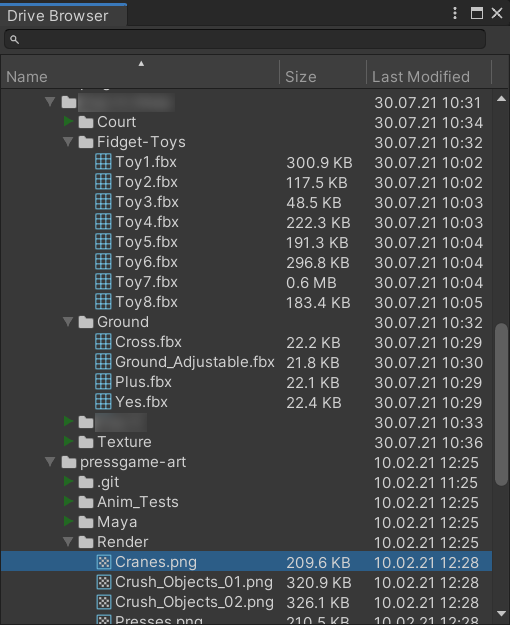
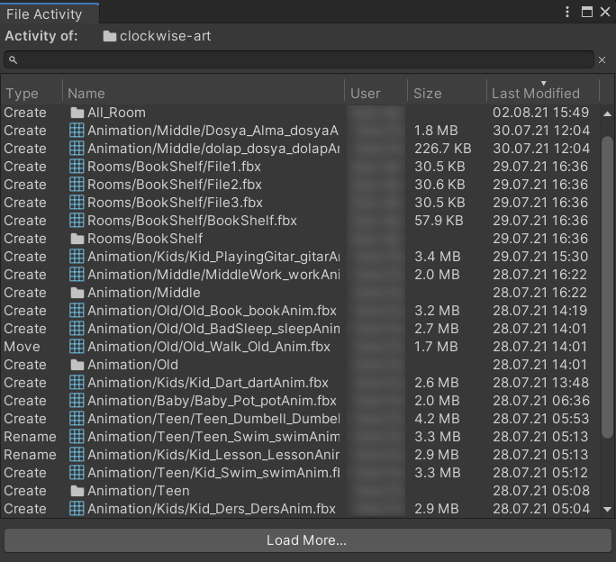

# Google Drive™ Integration for Unity Editor

This plugin helps you access your Google Drive™ files from within Unity editor. You can easily download these files to your Unity project or see the recent changes made to a file/folder. Please note that this plugin accesses Drive™ storage in read-only mode and doesn't allow uploading files to Drive™ or modifying the existing Drive™ files.

The plugin requires at least **.NET Standard 2.0** or **.NET 4.x** *Api Compatibility Level* in *Player Settings*. Tested on Unity 2018.4.34f1 and 2019.4.26f1.

**[Support the Developer ☕](https://yasirkula.itch.io/unity3d)**

## INSTALLATION

There are 4 ways to install this plugin:

- import [DriveIntegration.unitypackage](https://github.com/yasirkula/UnityEditorGoogleDriveIntegration/releases) via *Assets-Import Package*
- clone/[download](https://github.com/yasirkula/UnityEditorGoogleDriveIntegration/archive/master.zip) this repository and move the *Plugins* folder to your Unity project's *Assets* folder
- *(via Package Manager)* add the following line to *Packages/manifest.json*:
  - `"com.yasirkula.driveintegration": "https://github.com/yasirkula/UnityEditorGoogleDriveIntegration.git",`
- *(via [OpenUPM](https://openupm.com))* after installing [openupm-cli](https://github.com/openupm/openupm-cli), run the following command:
  - `openupm add com.yasirkula.driveintegration`

## HOW TO

- Create a *Google Cloud project*: https://github.com/yasirkula/UnityEditorGoogleDriveIntegration/wiki/Creating-Google-Cloud-Project
- Open the *Drive Browser* window via **Window-Drive Browser**. The first time this window is opened, it will prompt you to enter your Google Cloud project's credentials. Then, you'll be prompted to grant read-only access to your Drive™ files

- Drag&drop files/folders from the Drive Browser window to Project window to download them
- Right click a folder and select **View Activity** to see the recent changes made in that folder

- Right click the Drive Browser tab and select **Help** to learn more